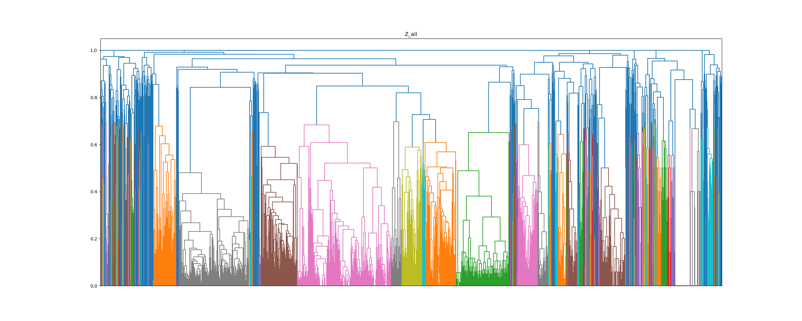

# Disegni-di-legge #

**Raggruppamento automatizzato dei disegni di legge simili al Senato italiano**

Il Senato italiano rende pubblici i propri dati.
Quindi è possibile eseguire un'analisi di clustering automatizzata sui dati per eliminare quelle che sono essenzialmente modifiche duplicate e ridurre il numero totale di modifiche che devono essere prese in considerazione.

## Installazione ##

1. Clona la repository: `git clone https://github.com/giovaxcortex90/Disegni-di-legge.git`
2. Installa le dipendezedentro la cartella di lavoro: `pip install -r requirements.txt`
3. Si scaricano tutti gli emendamenti di una certa legge con lo scripts scraper: `scrapy crawl cirinna` (ad esempio il ddl cirinna)
4. Avviare il cluster eseguendo il jupyter notebook della determinata legge: `jupyter notebook cirinna.ipynb` (ad esempio il ddl cirinna)

Un esempio in output di raggruppamento del disegno di legge cirinna

## Autore ##
Giovanni Battista Cortese

## License ##
